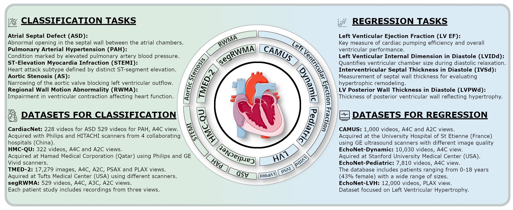

# CardioBench 🫀
**Do Echocardiography Foundation Models Generalize Beyond the Lab?**

> CardioBench is a standardized benchmark that unifies **8 public echocardiography datasets** spanning **4 regression** and **5 classification** tasks, evaluating cardiac-specific, biomedical, and general-purpose foundation models under **zero-shot, probing, and alignment** protocols.

[Preprint](https://arxiv.org/abs/2510.00520) · [Datasets](#datasets--tasks) · [Getting Started](#getting-started) · [Evaluation](#running-evaluations) · [Prediction Formats](#prediction-formats) · [Citation](#citation)

<p align="center">
  
</p>

## Datasets & Tasks
| Script | Dataset | Task(s) | Targets / Notes |
| --- | --- | --- | --- |
| `evaluation/camus.py` | CAMUS | EF regression + view classification | Per-patient EF, subgroup stats, view distribution |
| `evaluation/cardiacnet.py` | CardiacNet | ASD & PAH classification, multi-view | Supports EF-style view baselines |
| `evaluation/echonet_dynamic.py` | EchoNet-Dynamic | EF regression + view classification | Standard FileList split |
| `evaluation/echonet_lvh.py` | EchoNet-LVH | IVSd / LVIDd / LVPWd regression + view | Handles per-measure CSVs |
| `evaluation/echonet_pediatric.py` | EchoNet-Pediatric | EF regression, bias analysis, view | Subgroup plots (sex, age, BMI) |
| `evaluation/hmcqu.py` | HMC-QU | STEMI classification + view | Patient-split STEMI ROC metrics |
| `evaluation/rwma.py` | SegRWMA | RWMA detection + view | Supports per-view detectors (A2C/A3C/A4C) |
| `evaluation/tmed2.py` | TMED-2 | Aortic stenosis classification + view | Per-image/per-study handling |

Prediction templates for every task live in `evaluation/example_predictions/<DATASET>/`.

## Repository Layout
- `configs/` – dataset descriptors and workflow configs.
- `data/` – split CSVs generated by the workflow.
- `docs/downloads.md` – where and how to obtain each dataset.
- `evaluation/` – per-dataset evaluation scripts, config, sample predictions, and helpers.
- `src/` – training / probing utilities and baseline model code.

## Getting Started
### 1. Download Data
Follow the per-dataset instructions in [`docs/downloads.md`](docs/downloads.md).  

### 2. Configure Paths
Edit `evaluation/config.py` to point to:
- Your prediction folders.
- Desired output directories.

The config file also holds shared constants such as bootstrap count (`B`), seed, view labels, and evaluation split (`SPLIT="test"` by default).

## Running Evaluations
Each dataset/task has a standalone script:
```bash
python evaluation/<script>.py
# Example:
python evaluation/camus.py
```

Outputs (metrics CSVs, per-class accuracy, prediction histograms, plots, etc.) are written to the directories configured in `evaluation/config.py`.

Helpful tips:
- Ensure prediction IDs (`patient_id`, `HashedFileName`, `FileName`, etc.) match the split CSVs exactly.
- View classifiers must include `prob_<VIEW>` columns for every entry in `VIEW_CLASS_NAMES` plus `view_pred`.

## Prediction Formats
Use the CSVs inside `evaluation/example_predictions/` as templates.
- View models can omit `prob_Other`; the evaluator derives it as `1 - sum(prob_<known view>)`.
- Multi-target datasets (e.g., EchoNet-LVH) expect one CSV per measurement, named `<TARGET>_pred`.
- When in doubt, mirror the filenames inside `evaluation/example_predictions/<DATASET>/`.

## Baselines & Protocols
- `src/` contains code for zero-shot similarity, language-aligned prompting, and linear probes on top of frozen encoders.
- `normalize_pred/` includes utilities to harmonize scores across datasets before aggregation.
- Training and sweep configs live in `configs/` with Hydra-compatible YAMLs.

## Contributing
Contributions are welcome! Please open an issue or pull request for:
1. New prediction heads or evaluation tasks.
2. Bug fixes within the existing scripts.
3. Documentation or visualization improvements.

When submitting predictions or scripts, ensure you do **not** upload raw patient data—only derived metrics.

## Citation
If CardioBench is useful for your work, please cite:

```bibtex
@article{taratynova2025cardiobench,
  title={CardioBench: Do Echocardiography Foundation Models Generalize Beyond the Lab?},
  author={Taratynova, Darya and Aly, Ahmed and Saeed, Numan and Yaqub, Mohammad},
  journal={arXiv preprint arXiv:2510.00520},
  year={2025}
}
```

Preprint: [arXiv:2510.00520](https://arxiv.org/abs/2510.00520)
