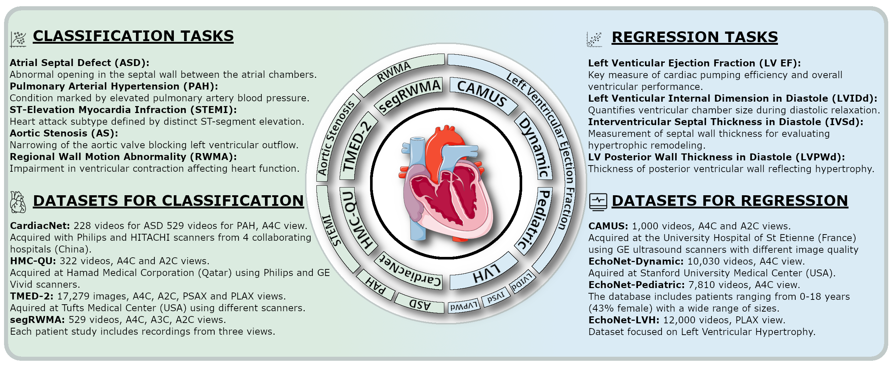

# CardioBench 🫀  
**Do Echocardiography Foundation Models Generalize Beyond the Lab?**

> CardioBench is a standardized benchmark unifying **8 echocardiography datasets** across **4 regression** and **5 classification** tasks. It evaluates cardiac-specific, biomedical, and general-purpose foundation models under consistent **zero-shot, probing, and alignment** protocols.

[**📄 Paper — coming soon**](#paper) • [📦 Datasets](#datasets) • [🔀 Splits](#dataset-splits) • [🧪 Evaluation](#evaluation) • [🧭 Predictions-format](#predictions-format) • [⚡ Baselines & Protocols](#baselines--protocols)

<p align="center">
  
</p>

## Motivation & Scope
Foundation models are rising in medical imaging, but echocardiography brings unique challenges: **noisy acquisitions**, **high frame redundancy**, **multi-view dependence**, and **limited public data**. CardioBench provides a **public, reproducible** way to compare models on functional (e.g., EF), structural (LVH measures), diagnostic (ASD, PAH, STEMI, RWMA), and **view recognition** tasks—under domain shift and demographic analyses.

**Key goals**
- Establish a **fair, reproducible baseline** for echo FMs.  
- Compare **cardiac-specific** vs **biomedical** vs **general-purpose** encoders.  
- Assess **zero-shot transfer**, **linear probing**, and **text–vision alignment**.  

## Repo Structure
```
CardioBench/
├── datasets/
│   ├── split/                 # split scripts (patient-level, view-aware)
│   └── config.py              # fill in absolute paths to downloaded datasets
├── example/
│   └── predictions/           # example predictions per dataset/task
├── evaluation/
│   ├── utils.py               # shared metrics & helpers
│   ├── <dataset>.py           # dataset-specific eval
│   └── config.py              # set paths to predictions/labels here
├── src/                    # zero-shot & linear-probing experiments
├── vizualizations/          # script for analysis plots
└── README.md
```

## Datasets

- [EchoNet-Dynamic](https://echonet.github.io/dynamic/)  
- [EchoNet-Pediatric](https://echonet.github.io/pediatric/)  
- [EchoNet-LVH](https://echonet.github.io/lvh/)  
- [CAMUS](https://www.creatis.insa-lyon.fr/Challenge/camus/)  
- [TMED-2](https://tmed.cs.tufts.edu/tmed_v2.html)  
- [HMC-QU](https://www.kaggle.com/datasets/aysendegerli/hmcqu-dataset/data)  
- [SegRWMA (Regional Wall Motion Abnormality)](https://www.kaggle.com/datasets/xiaoweixumedicalai/regional-wall-motion-abnormality-echo)  
- [CardiacNet (Abnormal Cardiac Echo Videos)](https://www.kaggle.com/datasets/xiaoweixumedicalai/abnormcardiacechovideos)  

Edit `./datasets/config.py` to point to your local copies (EchoNet-Dynamic, EchoNet-LVH, EchoNet-Pediatric, CAMUS, CardiacNet, HMC-QU, TMED-2, segRWMA).


## Splits
Split scripts live in `./datasets/split`.  
**Before running**, set dataset locations in `./datasets/config.py`.

```bash
python datasets/split/camus.py
python datasets/split/cardiacnet_asd.py
# ...etc for each dataset
```
- We use **official splits** where available; otherwise, patient-level, stratified splits (details in scripts).  

## Predictions Format
We provide **reference formats** in `./example/predictions/` for each dataset/task.  
Use them as templates for your model outputs.

> Ensure your **IDs match the split CSVs** produced by `datasets/split/*`.

## Evaluation
Evaluation is in `./evaluation`.
Set global paths in `./evaluation/config.py` (e.g., locations of ground truth, predictions).

**Examples**
```bash
# CAMUS
python evaluation/camus
```

Vizualization scripts are in `./vizualizations`.

## Paper
- **Title:** *CardioBench: Do Echocardiography Foundation Models Generalize Beyond the Lab?*  
- **Venue:** under review.
- **Preprint:** **TBA**


## Baselines & Protocols
We include code:
- **Zero-shot** similarity/prompting  
- **Linear probing** 

Details are described in ./src/

---

## License
Code is released under **Apache-2.0** (unless otherwise noted). Dataset licenses follow their respective providers—please comply with original terms.
